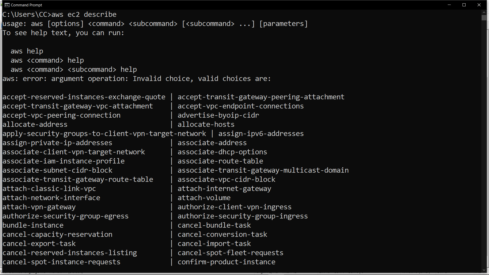
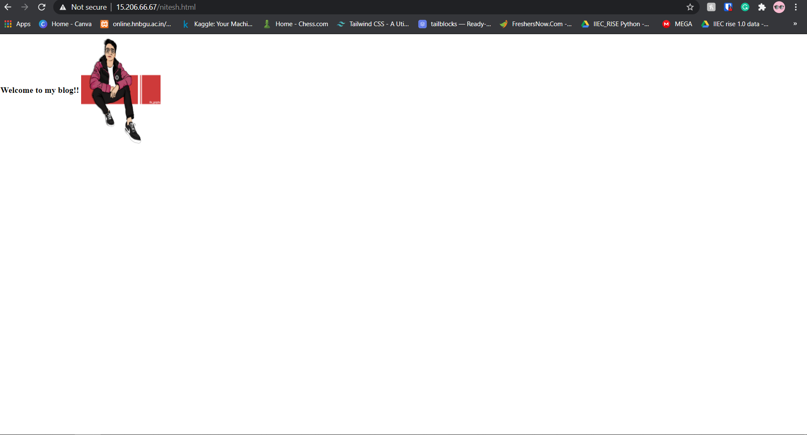

# Introduction

In this Microbyte we will create `High Availability Architecture` with AWS CLI. First let's understand `what is High Avialability?`

A highly available architecture involves multiple components working together to ensure uninterrupted service during a specific period. This also includes the response time to users’ requests. Namely, available systems have to be not only online, but also responsive.

Implementing a cloud computing architecture that enables this is key to ensuring the continuous operation of critical applications and services. They stay online and responsive even when various component failures occur or when a system is under high stress.

Highly available systems include the capability to recover from unexpected events in the shortest time possible. By moving the processes to backup components, these systems minimize downtime or eliminate it. This usually requires constant maintenance, monitoring, and initial in-depth tests to confirm that there are no weak points.

**Application:**If you want to deploy a website and want's your website to be fast, secure and you want your website to be available all the time even in the time of some failure in the network then`High Availabilty Architecture`comes in play.

It is important to create `High Avialability Architecture`to work efficiently without any delay due to failure.

In this MicroByte we will perform following activities:

- We will Launch an instance using AWS CLI
- We will configure Webserver 
- We will Create an EBS Volume
- We will Attach EBS Volume
- We will Create Partition
- We will create S3 Bucket
- We will Create Cloudfront Distribution

I hope you will learn by doing the Activities and will perform Task given in the Activities #LearnByDoing

# Prerequisites

- You should have AWS account.
- Install [AWS CLI](https://docs.aws.amazon.com/cli/latest/userguide/install-cliv2-windows.html) in Windows.
- Configure [AWS CLI with IAM user](https://bauddhik-geek.blogspot.com/2020/10/working-in-aws-using-aws-cli-with-help.html).
- It is preferred that you are aware [HTML basics](https://learn.crio.do/home/me/ME_HTML_CSS) and [Linux](https://learn.crio.do/home/me/ME_LINUX1)

### Activity 1: Launch an Instance using AWS CLI
First configure the AWS CLI in your window cmd by providing Access Key, Secret Key and region name.

If you are facing problem in configuring the AWS CLI then refer to the link provided in the `Prerequisites`

Now to launch an Instance, we require:

- Image-id
- Instance-type
- Count i.e how many instace we want to launch
- subnet-id
- Security-Group-id
- Key-name

> Syntax: `aws ec2 run-instances --image-id ami_ --instance-type _type_id --count no_of_instance --subnet-id -a57e77cd --security-group-ids group_id --key-name key_name`
  
> Refer to `Images/Activity1/Activity1a.png`

**Activity 1 Task:**

Try to find out the elements require to launch the instance using `aws ec2 describe `command in your cmd.

If you see the Following output 👇 that means instance is launched successfully:

> Refer to `Images/Activity1/Activity1b.png` 

### Activity 2: Configure Webserver

To Configure Webserver we need to install `httpd`i.e Apache Webserver in instance that you have launched in `Activity 1`.

To install `httpd` use command:`yum install httpd`

After httpd installation, we need to check whether service is started or not.

To check the httpd service use command:`systemctl status httpd`

> Refer to `Images/Activity2/Activity2a.png`

And to start the service use the command `systemctl start httpd`

> Refer to `Images/Activity2/Activity2b.png`

**Activity 2 Task:**

Above command to start the httpd service is temporary as soon as system shutdown service also stops so, try to find the command that will start the httpd service permanent.

### Activity 3: Create an EBS Volume

To Create an EBS Volume we require:

- Availability Zone name
- Size of Volume that we want to create.

> Syntax:`aws ec2 create-volume --availability-zone ap-south-1a --size 1`

Here `ap-south-1a` is availability zone, you have to give availability zone name where you have launched instance and `1` is the size of volume i.e 1Gb, you can give desired size to your volume.

> Refer to `Images/Activity3/Activity3a.png` 

### Activity 4: Attach EBS Volume to Instance

To attach the EBS Volume to an Instance we require:

- Volume-id (The volume that we have created in `Activity 3`)
- instance-id (The instance that we have launched in `Activity 2`)
- device (Example: /dev/sdf)

> Syntax: aws ec2 attach-volume --volume-id (volume_id) --instance-id (instance_id) --device(ex: /dev/sdf)

> Refer to `Images/Activity4/Activity4a.png` 

**Activity 4 Task:**

Find volume-id, instance-id using AWS CLI(**Hint**take help of `aws ec2 describe` command)

If not able to find using AWS CLI, you can also get it from AWS WebUi.

### Activity 5: Create and Format a Partition

Now open the instance that you have launched in `Activity 1`

run the command `fdisk /dev/xvdf` to create partition.

After running this commmand press `n` to create new partition and then press `p` and then enter.

To save the partition press `w`.

> Refer to `Images/Activity5/Activity5a.png` 

Now we need to format the partion.

To format the partition use the command `mkfs.ext4 device_name`

> Refer to `Images/Activity5/Activity5b.png` 

### Activity 6: Mount /var/www/html directory to partition

We need to mount `/var/www/html` directory to partition because we will create our html page in this directory and it will be safe in this partion even in the time of instance failure.

To mount the directory use the command `mount /dev/xvdf  /var/www/html`

And to check it is mounted or not use command `df -h`

> Refer to `Images/Activity6/Activity6a.png`  

### Activity 7: Create a HTML Page

To create HTML page go inside directory `/var/www/html` in your linux instance.

Create a HTML file.

**Activity 7 Task:**

Create Html page or you can create your own website.

### Activity 8: Create S3 Bucket

To create S3 Bucket we require:

- bucket name(you can give any name)
- region name(region name should be same like your instance region)

> Syntax:  aws s3api create-bucket --bucket <bucket name > --region <region name > --create-bucket-configuration LocationConstraint=<region name>

> Refer to `Images/Activity8/Activity8a.png` 

### Activity 9: Upload images in S3 Bucket

The images that you will use while creating website or webpage, store that images in S3 bucket so that images in your website will open with less latency or delay.

- Go to the AWS service in AWS WebUi
- Select S3 service
- Now select your bucket that you have created in `Activity 8`
- upload images
- Make the images that are uploaded public so that all can see your images.

> Refer to `Images/Activity9/Activity9a.png` 

Now copy the link of the images in the S3 Bucket and paste that link in your webpage.

> Refer to `Images/Activity9/Activity9b.png`
 
### Activity 10: Create Cloudfront Distribution
 
We create Cloudfront Distribution so that everyone in the world can access to our website with same speed like we access locally.

We will make Cloudfront Distribution of S3 bucket so that images will open without any delay when someone will access the website from other countries.

To create Cloudfront Distribution we require:

- origin-domain-name(S3 Bucket domain)

> Syntax: aws cloudfront create-distribution — origin-domain-name <bucket domain>

> Refer to `Images/Activity10/Activity10a.png` & `Images/Activity10/Activity10b.png`

**Activity 10 Task:**

Find S3 Bucket domain using AWS CLI or WebUi.

### Activity 11: Open your webpage or website

Now open the webpage using the Ip address of instance and file name in your browser .

By performig all Activities you can deploy your website with `High availability`,`secure` your website and make your website `manageable`.

## SUMMARY

Now we have created `High Availability Architecture` by creating an external storage so that our code will be safe even in the time of instance failure, Created S3 bucket to store images so that images will open without delay and created Cloudfront Distribution so that anyone across globe can access our  website with same speed like we access locally and we can monitor our webpage like we can see people from which country viewed our website or webpage and it makes or website secure.

## REFERENCES
- [TechTarget](https://searchdatacenter.techtarget.com/definition/high-availability)
- [FileCloud](https://www.getfilecloud.com/blog/an-introduction-to-high-availability-architecture/#:~:text=High%20availability%20architecture%20is%20an,at%20times%20of%20high%20loads.)

