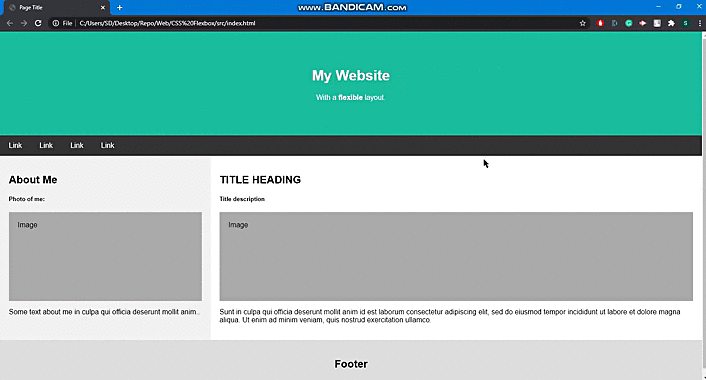

# Introduction  

CSS Flexible Box Layout, commonly known as CSS Flexbox, is a CSS3 web layout model. The flex layout allows responsive elements within a container to be automatically arranged depending upon screen size.  

In this micro-byte, we'll create a fully responsive webpage design layout consisting of multiple sections. We'll employ CSS flexbox properties to aid in our website styling and learn a lot of things along the way.  

## Prerequisites

It's preferable to have working introductory knowledge on HTML markup and CSS styling. You'll need a working HTML code editor and a web browser(Chrome, Safari, etc) for this awesome activity. 

## Activities  


### Activity 0: Choose a HTML editor and create two new files with .html and .css extensions

**We'll begin with a working HTML code editor. So go ahead and fire it up. There are a lot of options to choose from including:**

1. `Codepen`
2. `Notepad ++`
3. `VSCode`
4. `Sublime Text3`
5. `NetBeans`

I'll be using Sublime Text3 for this module.  

Now we'll specify that we intend to create a new HTML file as well as a CSS file. Do this by creating two new files and saving them with the `.html` and `.css` extensions as shown.  

Type in the file name (whatever you choose), and then follow it with **.html**.For example-> ``index.html``.  

> Refer to images/Activity-1/img1a.PNG in this folder.

In a similar way, type in any file name (your choice) and save it with **.css**. For example-> ``style.css``.    

> Refer to images/Activity-0/img0a.PNG in this folder.  


### Activity 1: Start typing in the HTML code inside the code editor

Start your workflow by typing in this basic HTML skeleton code in the `.html` file. So go ahead and type in the following:  

```
<!DOCTYPE html>
<html lang="en">
<head>
  <meta charset="UTF-8">
  <link rel="stylesheet" href="style.css"/>
  <title></title>
</head>

<body>

</body>
</html>
```  

`<link rel="stylesheet" href="style.css"/>`--> This line will link our CSS file to our HTML code.  

> Refer to `images/Activity-1/img1a.PNG` in this folder.

### Activity 2: Adding relevant HTML code to build the basic foundation of our website

Our fictitious website will comprise of 4 major components, namely:  

- **Header section**
- **Navbar with nav-links**
- **Body section**
- **Footer section**

Let's start by adding a header section using HTML **<**div>** tag and assigning it a classname **header**. Add some <**h1**>-based heading and paragraph (<**p**>) element in it as well.

> Refer to `src/Activity-2/activity2a.html` in this folder for relevant code.

Now add a block element (<**div**>) inside the body and assign it a classname **navbar**. Add 4 anchor tags inside the <**div**> tags and assign names as per your choice.  

> Refer to `src/Activity-2/activity2b.html` in this folder for relevant code.

Now we'll start working with the actual body content of our website.  

So go ahead and create a <**div**> element with an random classname (here, I've used classname as **left**). We'll also add a subheading (**h2**) and another <**div class="img1"**> tag inside our parent <**div**> tag. Finally we'll add a fictitious description beneath it using the <**p**> element as shown below.

> Refer to `src/Activity-2/activity2c1.html` in this folder for relevant code.  

Next we'll create a second <**div**> element with an random classname (here, I've used classname as **right**) and assign the exact same contents to this <**div**> as well. Enclose both the <**div**> tags inside a container <**div**> tag and assign it a random classname. (here, I've used **parent** as the classname)

> Refer to `src/Activity-2/activity2c2.html` in this folder for relevant code.  

Finally, let's add a footer section. We'll be using a <**div**> element for this purpose. Assign a non-ambiguous classname to it (here, I've used **footer** as classname) and add a small description inside this <**div**> tag as shown below.

> Refer to `src/Activity-2/activity2d.html` in this folder for relevant code.  

### REFERENCES
1. [HTML Block Elements](https://www.w3schools.com/html/html_blocks.asp)
2. [CSS Pseudo Classes](https://www.w3schools.com/css/css_pseudo_elements.asp)  


### Activity 3: Adding CSS styling to the header section and navbar

We'll add CSS now to add proper styling to our website.  

Let's start off by referencing the header section using it's assigned classname inside our CSS source file. We'll add a definitive padding and background color to our <**div**> element and assign a contrasting text color to the <**h2**> tag inside it. We'll also align the text centrally inside the header section. I've used the following values for the header section:  

- padding: 60px;
- background-color: #1abc9c;
- color: #fff;  

> Refer to `src/Activity-3/style3a.css` for complete code reference.  

Now we'll first align the anchor tags next to each other using `display: flex` property. Since the default value of **flex-direction** property for our flex-items (<**a**> tags) is **row**, the anchor tags are automatically aligned next to each other. Apply a definitive padding and text-color to the anchor tags to add a pop effect to the tags.  

> Refer to `src/Activity-3/style3b.css` for relevant code.  

Finally add a hover effect to the anchor tags using `::hover` pseudo-class. 

> Refer to `src/Activity-3/style3c.css` for relevant code.  

### REFERENCES
1. [CSS Flex Property](https://www.w3schools.com/css/css3_flexbox.asp)  


### Activity 4: Adding CSS styling to the body section  

Now we'll position the two <**div**> tags namely **left** and **right** adjacent to each other. Let's use display property `flex` to achieve that. 

> Facing issues? Refer to `src/Activity-4/style4a.css` for relevant details.

Now we'll assign different widths to the children <**div**> tags using property named **flex** (P.S.: It's a flexbox substitute for **width**). Go ahead and assign widths of 30% and 70% to the `left` and `right` <**div**> tags respectively. Once you're done with that, we'll assign different background colours to our children `<div>` tags and add consistent padding to both the div elements.  

> Facing issues? Refer to `src/Activity-4/style4b.css` for relevant details.

At this stage, we need to assign a definitive padding to our images (represented using `div` tags) as well as add consistent background-color to it.  So go ahead and add some padding and background-color to the **images** based on your imagination.  

> Facing issues? Refer to `src/Activity-4/style4c.css` for relevant details.  

### REFERENCES
1. [CSS Display Property](https://www.w3schools.com/css/css_display_visibility.asp)
2. [CSS Padding](https://www.w3schools.com/css/css_padding.asp)  


### Activity 5: Adding CSS styling to the footer section and using media query to create responsive design  

We've almost reached the end of this Crio-byte. That's no small feat!!!

So now we'll add padding to the footer section as well as a consistent background-color to it. I leave it entirely upto your imagination. If you're unable to add styling or facing some other issues, just look below: 

> Refer to `src/Activity-5/style5a.css` for relevant details.  

Finally we'll add a media query to aid in responsive design on a smaller viewport. Don't know what a media query is? No worries. We've attached a link in the `References` section explaining all about it.  

So now we'll create a media query that triggers on all devices below 768 pixels.  

<details>
  <summary>Need a hint? Expand to know more </summary>
  
  ```
  @media all and (max-width: 768px){  
  
  }
  ```  
  
</details>

We want our flex-items to align vertically on a smaller viewport for enhanced readability. So go ahead and add necessary code to the navbar and parent <**div**> tags that does the same.  

<details>
  <summary>Need a hint? Expand to know more </summary>
  
  ```
  @media all and (max-width: 768px){  
    .parent, .navbar{  
      flex-direction: column;  
    }  
  }  
  ```  
  
</details>

**Your final result should look something like this:**  

<p align="center"></p>

> You can refer to `images/Activity-5/output/PNG` as well to view your final responsive web design.  

## CONCLUSION  

Congratulations on reaching this stage. I'm sure you've learnt a lot from this microbyte. You should now have understood the basics of CSS flexbox and how handy it is when it comes to aligning items inside a webpage and making responsive webpage designs. Go ahead, flaunt your design, or even better, build a working website out of it.🎉🎉

## REFERENCES  

1. [W3Schools](https://www.w3schools.com/css/)
2. [MDN Web Docs](https://developer.mozilla.org/en-US/docs/Web/CSS)
3. [Tutorials Point](https://www.tutorialspoint.com/index.htm)

