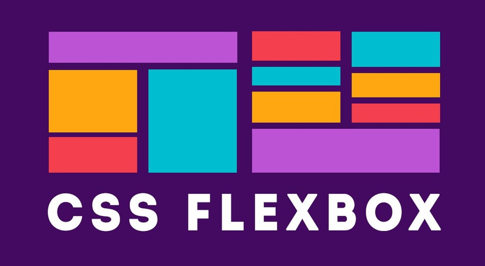
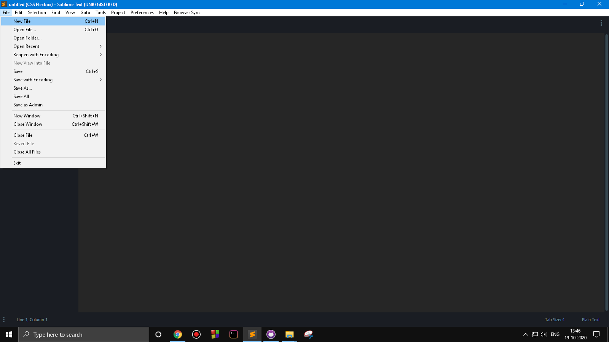
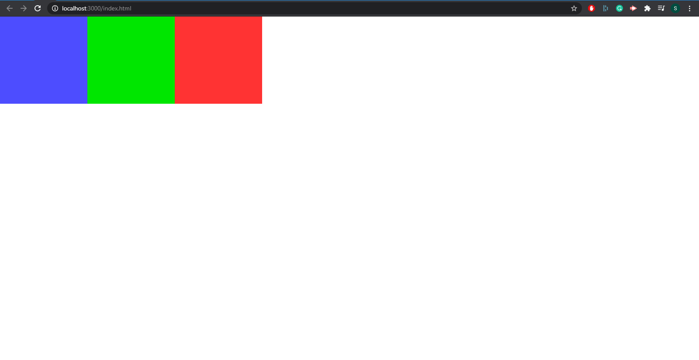
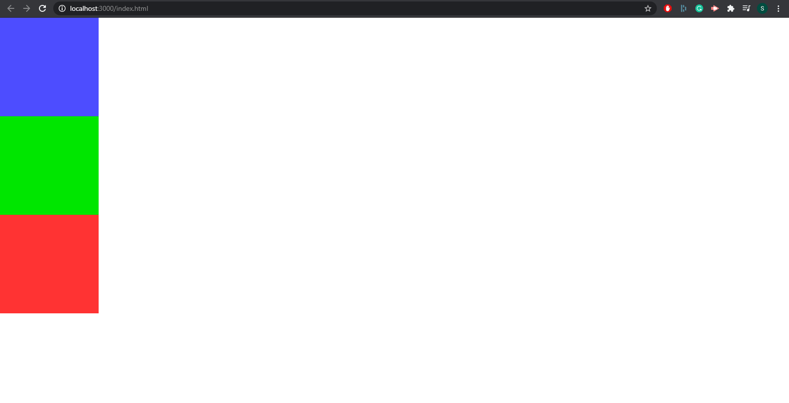
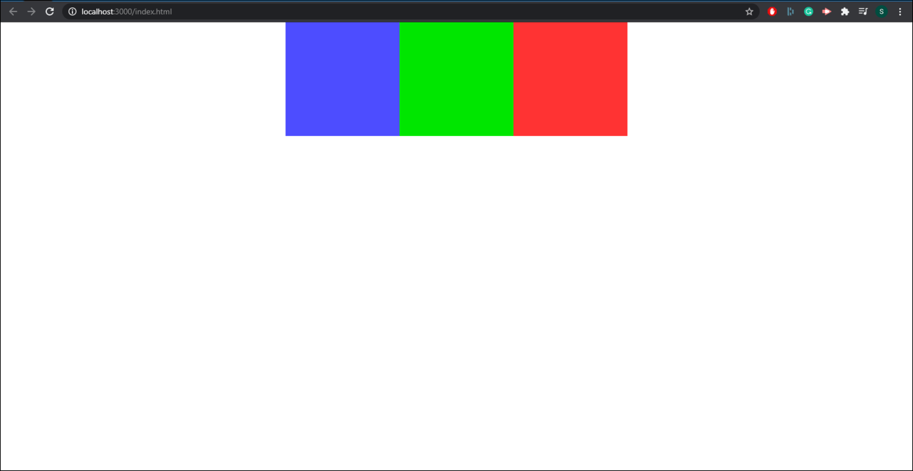
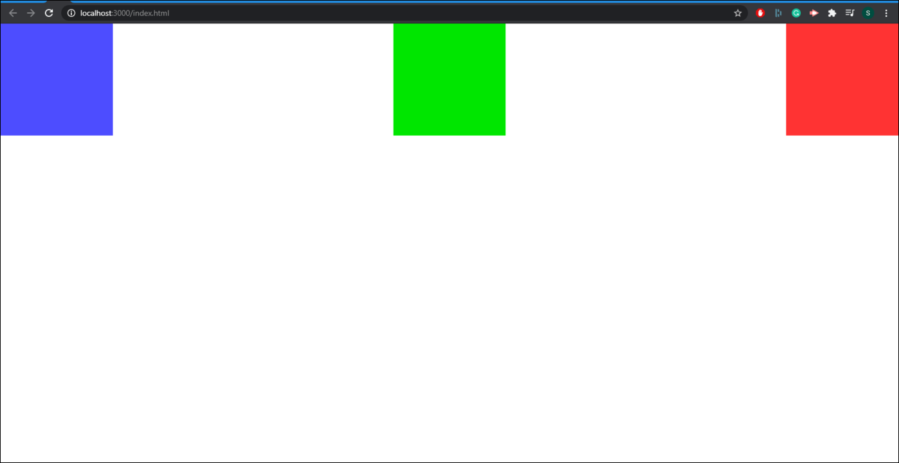
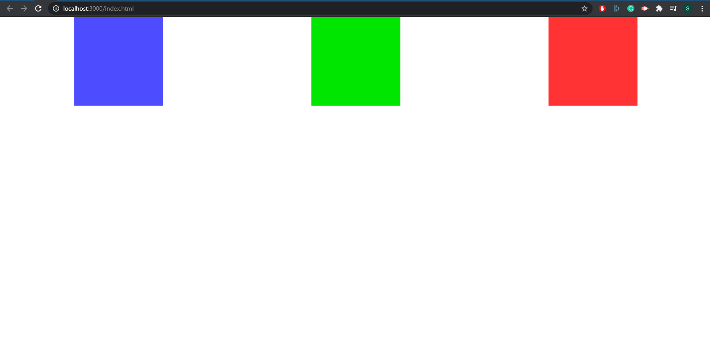
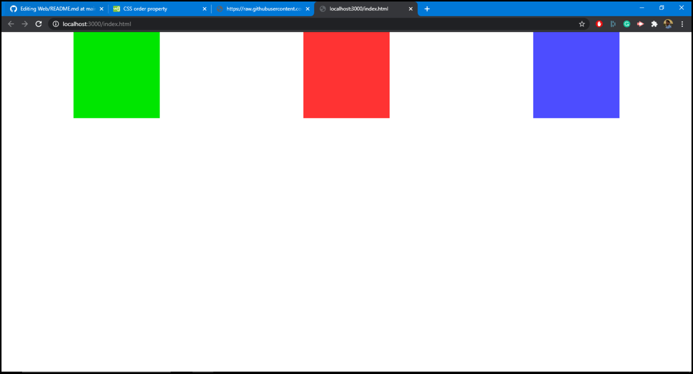
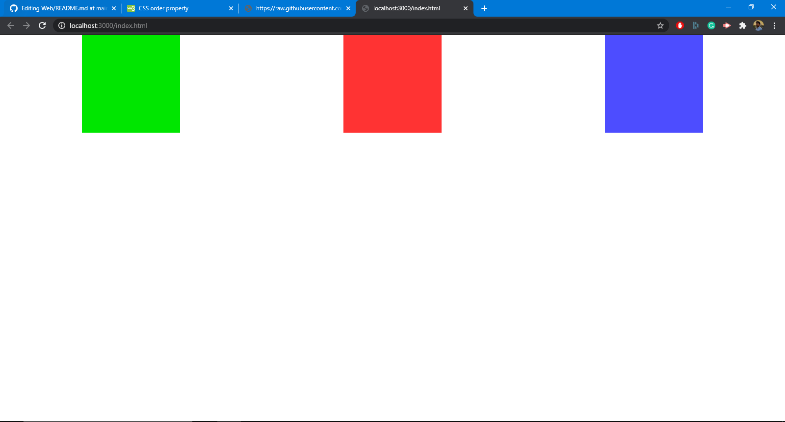

# Introduction  

CSS Flexible Box Layout, commonly known as CSS Flexbox, is a CSS3 web layout model. The flex layout allows responsive elements within a container to be automatically arranged depending upon screen size.

## Prerequisites

You'll need a working HTML code editor and a web browser (Chrome, Safari, etc) for this awesome activity. Let's go ahead and jump right in!!!



## Activities

### Activity 1: Choose a HTML editor

**We'll begin with a HTML code editor. So go ahead and fire it up. There are a lot of options to choose from including:**

1. `Codepen`
2. `Notepad ++`
3. `VSCode`
4. `Sublime Text3`
5. `NetBeans`

I'll be using Sublime Text3 for this module.  


### Activity 2: Create two new files with .html and .css extensions

In this step, we'll specify that we intend to create a new HTML file as well as a CSS file. Do this by creating two new files and saving them with the `.html` and `.css` extensions as shown.  

Just type the file name (whatever you choose), and then follow it with **.html**. For example-> ``index.html``.  
In a similar way, type in any file name (your choice) and save it with **.css**. For example-> ``style.css``.  

Yeah, it’s that simple. Here's a preview of how it's done:  

  


### Activity 3: Start typing in the HTML code inside the editor

Start your workflow by typing in this basic HTML skeleton code in the `.html` file. So go ahead and type in the following:  

```
<!DOCTYPE html>
<html lang="en">
<head>
  <meta charset="UTF-8">
  <link rel="stylesheet" href="style.css"/>
  <title></title>
</head>

<body>

</body>
</html>
```  

`<link rel="stylesheet" href="style.css"/>`--> This line will link our CSS file to our HTML code.  


### Activity 4: Getting familiar with relevant HTML tags 

We'll proceed with an introduction to relevant HTML tags. The commonly used HTML tags here are as follows:  

1. `<div>`: The ***div*** tag is used as a container for HTML elements which is then styled with CSS.
2. `<p>`: The HTML ***p*** element represents a paragraph or a block of code.  

Now we can start learning about CSS flexbox and it's awesome properties.  


### Activity 5: Adding relevant HTML code inside the HTML file and styling it with CSS

Now go ahead and type in the following code inside the HTML skeleton code.  

```
<!DOCTYPE html>
<html lang="en">
<head>
	 <meta charset="UTF-8">
	 <link rel="stylesheet" href="style.css">
	 <title></title>
</head>

<body>
  <div class="parent">
    <div class="child1">
  
    </div>
    <div class="child2">
  
    </div>
    <div class="child3">
			
    </div>
  </div>
</body>
</html>
```  

So here we're nesting three `<div>` tags inside a parent `<div>` tag. The three children `<div>` tags are assigned class names `child1` , `child2` and `child3` respectively. At this stage nothing will be visible inside your web browser. We have a fix for this................. Yes, you guessed it right. It's CSS!!

So go in and add this basic CSS code inside your `.css` file as follows:

```
*{
	box-sizing: border-box;
	margin: 0;
	padding: 0;
}

.child1{
	width: 200px;
	height: 200px;
	background-color: #4d4dff;
}

.child2{
	width: 200px;
	height: 200px;
	background-color: #00e600;
}

.child3{
	width: 200px;
	height: 200px;
	background-color: #ff3333;
}
```
<details>
<summary>Done with the task? Expand this to see the expected output</summary>  
	
  

</details>	


### Activity 6: Adding different CSS flexbox properties to style our `<div>` tags  

Our first action will be to assign `display` property as **flex** for the parent `<div>` tag as follows:  
```
.parent{
  display: flex;
}
```

There are quite a few properties when it comes to CSS flexbox. Let's go through them one at a time. 

1. `flex-direction`   

**It sets the direction of the flexible items inside the parent `<div>` element.** It's pre-defined values include:  

a. ***row***: This is the default value. The flexible items are displayed horizontally, as a row. Add it to the parent `<div>` tag as follows:  
```
.parent{
  display: flex;
  flex-direction: row;
}
```

The output will be something like this now:
  

b. **column**: Adding this value will align the `<div>` tags in a column. Apply this property as follows:  
```
.parent{
  display: flex;
  flex-direction: column;
}
```  

<details>
<summary>Done with the job? Expand to see the expected output</summary>
	
  

</details>  

### MICRO-TASK

> Explore the **row-reverse** and **column-reverse** properties under flex-direction and try to apply it to the `<div>` tags 
<details>
<summary>Need a hint? Expand to reveal your clue</summary>
	
```
.parent{
  display: flex;
  flex-direction: column;
}
```  
</details>  


2. `justify-content`  

The justify-content property aligns the flexible container's items when the items do not use all available space on the main-axis. It's pre-defined values include:  

a. ***flex-start***:

**It's the default value for this property. Items are positioned at the beginning of the container.** Apply this property as follows:  
```
.parent{
  display: flex;
  justify-content: flex-start;
}
```  

The output will be something like this now:
  

b. ***center***:

Adding this value will position the items in the middle of the container. Apply this property as follows:  
```
.parent{
  display: flex;
  justify-content: center;
}
```  

<details>
<summary>Done with the task? Expand to see the expected output</summary>  
	
  

</details>

c. ***space-between***:

Adding this value will position the items with space between the lines. Apply this property as follows:  
```{
.parent{
  display: flex;
  justify-content: space-between;
}
```  

<details>
<summary>Done with the task? Expand to see the expected output</summary>  
	
  

</details>

### MICRO-TASK

> Explore the **flex-end**, **space-around** and **space-evenly** properties under flex-direction and try finding out the result  

<details>
<summary>Need a hint? Expand to reveal your clue</summary>

```
.parent{
  display: flex;
  justify-content: flex-end | space-around | space-evenly;
}
```  
</details>  


3. `align-items`  

**The align-items property specifies the default alignment for items inside the flexible container.** It's pre-defined values include:  

a. ***flex-start***:  

This value positions items at the beginning of the container. It's implemented as follows:  
```{
.parent{
  display: flex;
  justify-content: space-between;
  align-items: flex-start;
}
```  

The output will be something like this now:
  

b. ***flex-end***:  

This value positions items at the bottom of the container. It's implemented as follows:  
```{
.parent{
  display: flex;
  justify-content: space-between;
  align-items: flex-end;
}
```  

<details>
<summary>Done with the task? Expand to see the expected output</summary>  
	
  

</details>  

### MICRO-TASK

> Explore the **center**, **baseline** and **stretch** properties under `align-items` and see what you get (HINT: align-items: center | stretch | baseline)  

<details>
<summary>Need a hint? Expand to reveal your clue</summary>

```
.parent{
  display: flex;
  align-items: center | stretch | baseline;
}
```  
</details>  

4. `order`  

**The order CSS property sets the order to lay out an item in a flex or grid container.** It's pre-defined values include:  

a. ***Number***:  

This value accepts a numerical value that directs the position of the children `<div>` tags according to size of the value. Lower the number, higher is it's priority and is thus positioned near the beginning of the flexbox.  

Let me clarify this through an example as shown below: 

Type in the following CSS code as shown below:  

  

The output should be something like this:  

  

So what's happening here is this:  

`<div class="child1">` has an assigned order of 3 (blue coloured). So it's been pushed to the third position in the flexbox. Similarly, since `<div class="child2">` has an order of 1, it has the highest priority and is thus assigned the first position in the flexbox (green coloured). Finally, `<div class="child3">` having an order of 2 finds itself wedged midway between the other two `<div>` tags at second position (red coloured).


> Refer to the completed code on CSS flexbox here: [CSS flexbox](./src/index.html)  

## CONCLUSION  

Congratulations on reaching this stage. I'm sure you've learnt a lot from this microbyte. You should now have understood the basics of CSS flexbox and how handy it is when it comes to aligning items inside a webpage and making responsive webpage designs. 🎉🎉

## REFERENCES  

1. [W3Schools](https://www.w3schools.com/css/)
2. [MDN Web Docs](https://developer.mozilla.org/en-US/docs/Web/CSS)
3. [Tutorials Point](https://www.tutorialspoint.com/index.htm)

