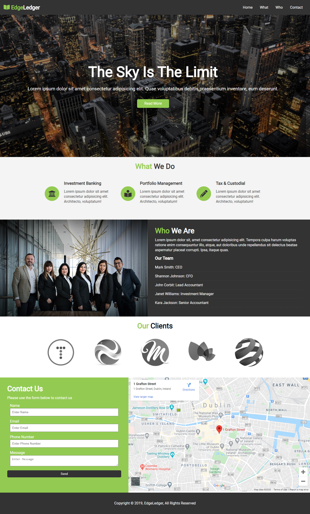

# Introduction

Hello Geeks, I hope you are doing great and fine as well. You all know about the terms "Investments, Funds and Financial Services" etc. You can able to invest your money via their sites or an app. In most cases, we all use their sites and invest our money so that they give us more. Here, our intention is not to invest our money, actually it's all about their sites. How their UI approaches? 

In this Microbyte, We will create a site named "EdgeLedger Financial | Accounting and Investment". This site remains a static website. You would need to mainly work on its UI i.e, some HTML and CSS.

One of the screenshots is given below:
#### It is the Home page of our static website. 



# Prerequisites

For creating the static website, you must have familiar with HTML, CSS and some knowledge of IDE's. 
If you don't know so much about that then don't worry, we will provided you all the materials so at the result you can easily create the static site. 

Reference Material for HTML: https://www.w3schools.com/html/  <br/>
Reference Material for CSS: https://www.w3schools.com/css/default.asp


# IDE's(integrated development environment)

For writing code, you need a IDE or a code editor in which you can write your own code and able to edit in the code. There are lot of IDE's or editor in which you can code. 
Some of the best editor are Notepad++, Visual Studio Code, Sublime Text etc. You can even code in your Notepad that is preinstalled in windows but it is highly recommended to use IDE's/editor due to developer convinience. Here are the tutorials to download and setup the editors.

[VS Code](https://code.visualstudio.com/download)<br/>
[Sublime Text](https://www.sublimetext.com/3)<br/>
[Notepad++](https://notepad-plus-plus.org/downloads/)

We highly recommend to use VS Code because in this editor, there are many extensions which is very useful for the developer like formatting document, live server etc. You can search more just typing in the google and search for the right one.

Here is the [link](https://www.youtube.com/watch?v=TeZdo8mx0gc) for installing the VS Code and its extension.


# Activities

## You need to write your own code in the place of TODO comments.

## Activity 1: Connecting Google Maps 

In "index.html" file, You would need to code for the "Google Maps" as show in the given screenshot provided to you in the screenshot folder. Don't hesitate if you don't know about the google maps, API's, we will give you the reference links, and suggests that go through these reference links.

Reference: https://www.maps.ie/create-google-map/

```
    <div class="map-frame" style="width: 800px;">
      <!-- write your code here -->
    </div> 
```

## Activity 2: Design your "index.html" file

Now it's time to styling your "index.html", so that it looks attractive. There is already styling of your home page for the "Computer Screens". You would need to style the site for the "Mobile Screens" in the given "mobile.css" provided in the css folder. Please go through the reference link and explore more. 

Reference: https://www.w3schools.com/html/html_responsive.asp

```
@media(max-width: 500px) {
  #navbar {
    flex-direction: column;
    align-items: center;
  }

/* write your code here  */
}

@media(max-height: 568px) {
/* write your code here  */
}
```

The screenshot provided to you in the screenshot folder for your help. You can take ideas how can you design the "index.html" file for the "mobile screen".


# Reference
[HTML: Hypertext Markup Language](https://www.w3schools.com/html/)<br/>
[CSS: Cascading Style Sheets](https://www.w3schools.com/css/default.asp)<br/>
[Visual Studio Code](https://code.visualstudio.com/download)
  
