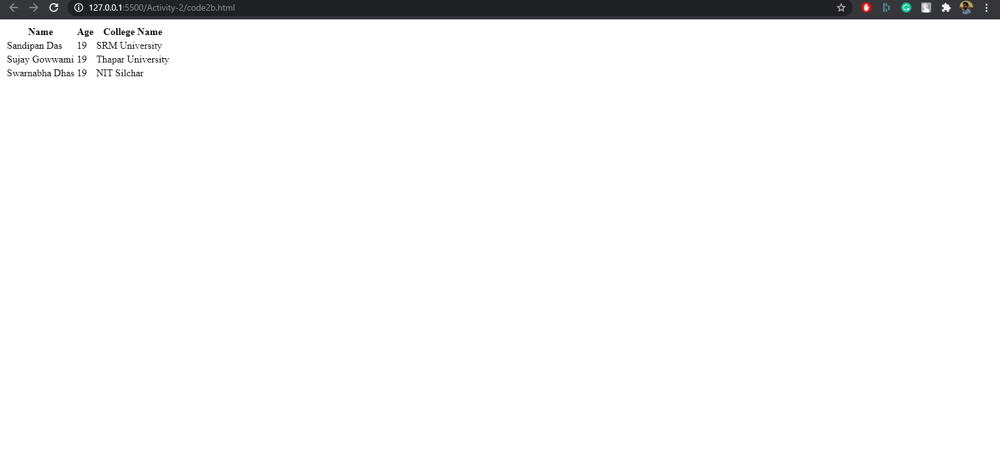
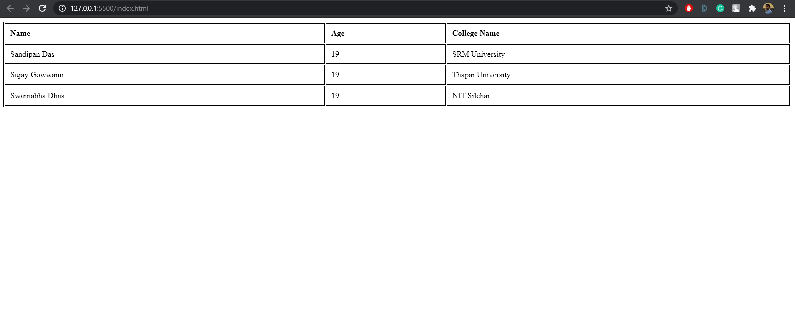

# Introduction  

A table is an arrangement of data in rows and columns, or possibly in a more complex structure. Tables are widely used in communication, research, and data analysis and are assets in the real-world.

## Prerequisites

You'll need a working HTML code editor and a web browser for this activity. For this microbyte, you should have a basic knowledge of:

- HTML (recommended)
- CSS (recommended)

## Activities

> NOTE: Links for relevant resources have been attached below that can be refered to in case you aren't familiar with any concept used. So kindly check those out as well.  

### Activity 0: Setting up our workspace

**You'll first need a HTML code editor to before you begin this module. There are a lot of options to choose from including:**

1. `Codepen`
2. `Notepad ++`
3. `VSCode`
4. `Sublime Text3`
5. `NetBeans`

All of these editors have user-friendly interfaces that enable you to manually enter the code. I'll be using VSCode for this module.  

- Go ahead and create two seperate files ending with **.html** and **.css** extensions inside the code editor of your choice.  

Done? Let's move on.  

### Activity 1: Start typing in the HTML code inside the code editor  

- Start your workflow by typing in the **basic template** used for any HTML code. Make sure to **link our external CSS file** inside the HTML file.  

> Don't know how to begin? Refer to `src/Activity-1/code1a.html` inside the folder  

### Micro-References

1. [HTML tutorial](https://www.w3schools.com/html/)  

### Activity 2: Implementing the basic tabular structure using HTML  

Our aim here is to create a full-fledged HTML table.

### Tasks

- Go ahead and create three table headers with any experimental names of your choice and arrange them in a row using HTML markup.  

> Need a hint? Go to `src/Activity-2/code2a.html` inside the folder  

- Now add two or three blocks of **table cell data** under the table headers created in `Activity-2/task-a`. Make sure to arrange them out **horizontally** as well using HTML markup.  

> Need a hint? Go to `src/Activity-2/code2b.html` inside the folder  

At the end of this activity, our table should look something like this 

	

### Micro-References  

1. [HTML Tables](https://developer.mozilla.org/en-US/docs/Web/HTML/Element/table)  

### Activity 3: Adding CSS stying to our existing HTML tabular structure

Our HTML table looks pretty ugly at this stage.😂 So we'll add CSS styling in this activity to enhance our existing tabular structure and beautify it.  

- Let's start by adding a **border outline** to the entire table and expand it's **width** to occupy the entire width of the browser.  

> Need some help? Look into `src/Activity-3/style3a.css` inside the folder for relevant details    

- To add a consistent look to the table data, go ahead and **align** the table cell data (including headers) in a **left** fashion. Make sure to reference existing HTML tags to achieve this.  

> Need some help? Look into `src/Activity-3/style3b.css` inside the folder for relevant details  

- Now, add a dark border outline around each table cell element (including headers). Finally, add a consistent **padding** to our table cell elements (including headers, mind you) and you'll have created the final design of our proposed HTML table.  

> Need some help? Look into `src/Activity-3/style3c.css` inside the folder for relevant details

At the end of this activity, we'll have achieved something like this 

	

### Micro-References  

1. [CSS Text Align](https://developer.mozilla.org/en-US/docs/Web/CSS/text-align)
2. [CSS Borders](https://www.w3schools.com/css/css_border.asp)  

## SUMMARY

Congratulations on completing this module.🎉🎉 We've just created a full-fledged tabular structure using only HTML markup and basic CSS styling. You should now be confident enough in your ability to design a working HTML table structure using basic HTML and CSS from scratch. So go ahead, experiment with it and build more complex HTML tables, wherever your imagination takes you. In the end, we belive you learnt something new today by doing.  

## REFERENCES

1. [MDN Web Docs](https://developer.mozilla.org/en-US/)
2. [Tutorials Point](https://www.tutorialspoint.com/index.htm)
3. [Markdown Cheat Sheet](https://www.markdownguide.org/cheat-sheet/)

