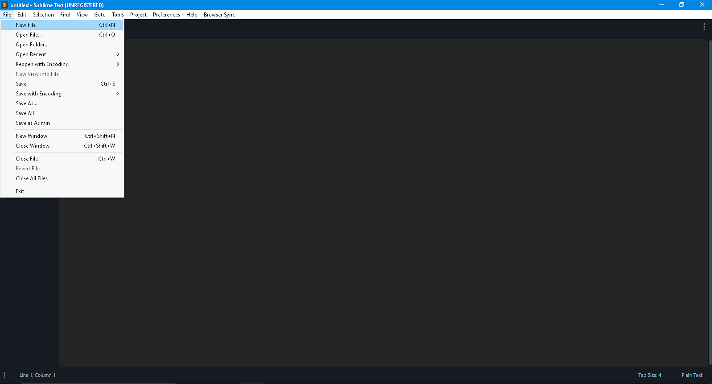
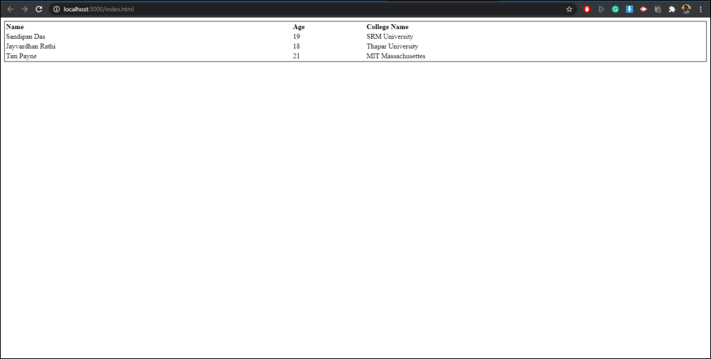
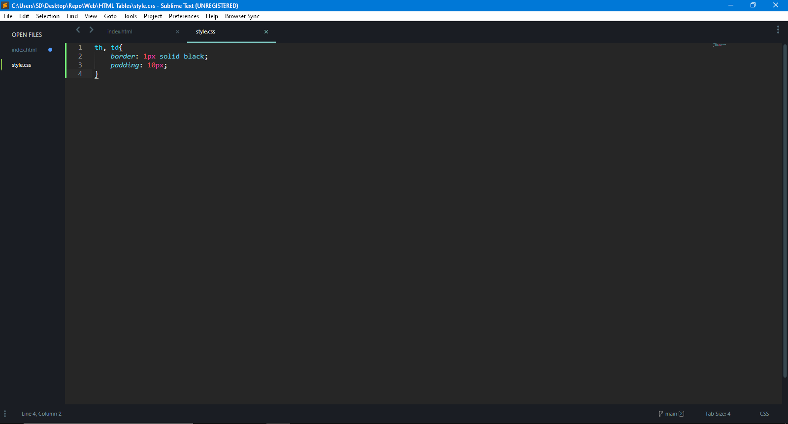
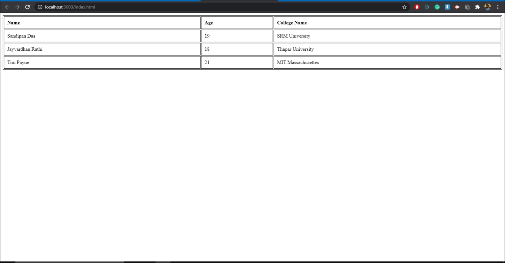

## Introduction  

A table is an arrangement of data in rows and columns, or possibly in a more complex structure. Tables are widely used in communication, research, and data analysis and are assets in the real-world.

## Prerequisites

You'll need a working HTML code editor and a web browser for this activity. **No prior background knowledge** of HTML or CSS is required to grasp this module. It's that easy!!

## Activities

### Activity 1: Choose a HTML editor

**You'll first need a HTML code editor to before you begin this module. There are a lot of options to choose from including:**

1. `Codepen`
2. `Notepad ++`
3. `VSCode`
4. `Sublime Text3`
5. `NetBeans`

All of these editors have user-friendly interfaces that enable you to manually enter the code. I'll be using Sublime Text3 for this module.  


### Activity 2: Create two new files with .html and .css extensions

The next step is to specify that you intend to create a new HTML file as well as a CSS file. Do this by creating a new file and then saving it with the .html extension as shown. It’s easy. Just type the file name (whatever you choose), and then follow it with **.html**. For example-> ``index.html``.

In a similar way, type in any file name (your choice) and save it with **.css**. For example-> ``style.css``.  



### Activity 3: Start typing in the HTML code inside the editor

Start your workflow by typing in the basic HTML skeleton code in the .html file. So go ahead and type in the following: 

```
<!DOCTYPE html>
<html lang="en">
<head>
  <meta charset="UTF-8">
  <link rel="stylesheet" href=""/>
  <title></title>
</head>

<body>

</body>
</html>
```

We'll use `<link rel="stylesheet" href=""/>` statement to add external CSS to our HTML code in further steps.  


### Activity 4: Getting acquainted with HTML table tags

We'll proceed with an introduction to HTML table tags. The commonly used HTML tags here are as follows:

1. `<table>` -> This defines an HTML table.
2. `<tr>`    -> This defines a table row.
3. `<th>`    -> This defines a table header.
4. `<td>`    -> This defines a table cell.

Now we can start with building a simple table using HTML.  

### References  

1. [HTML Tables](https://developer.mozilla.org/en-US/docs/Web/HTML/Element/table)

### Activity 5: Filling in the fields and building our first table

Once we've reached this stage, it's now time to get our hands dirty. So go ahead and type in the following code in your code editor:

```
<!DOCTYPE html>
<html lang="en">
<head>
  <meta charset="UTF-8">
  <title></title>
  <link rel="stylesheet" href=""/>
</head>

<body>
  <table style="width:100%; border: 1px solid black">
		<tr style="text-align: left">
			<th>Name</th>
			<th>Age</th>
			<th>College Name</th>
		</tr>
    
		<tr style="text-align: left">
			<td>Sandipan Das</td>
			<td>19</td>
			<td>SRM University</td>
		</tr>
    
		<tr style="text-align: left">
			<td>Jayvardhan Rathi</td>
			<td>18</td>
			<td>Thapar University</td>
		</tr>
    
		<tr style="text-align: left">
			<td>Tim Payne</td>
			<td>21</td>
			<td>MIT Massachusettes</td>
		</tr>
	</table>

</body>
</html>
```

At this stage, our table will look something like this:  
  

Lets take it one step at a time okay. Firstly, the `<tr>` tag defines a HTML row and directs the succeeding code to be arranged in the form of rows. The `<th>` tag now defines the table column heading names in bold letters and the `<td>` tag dictates each table cell value, which is apparently not very clear at this point. We'll be adding CSS to improve this condition.  

We're using inline CSS inside the `<style>` tag. In this way we're adding CSS styling directly inside our HTML tags. 
You’ll notice that each time you want to create a new field in your table, you have to type the command `<tr>` and then close the command with `</tr>`. Same goes for every other HTML tags.  

Let me explain the inline CSS statements used here.  

1. ***text-align***: The text-align property specifies the horizontal alignment of text in an element.  
2. ***border***: The text-align property specifies the horizontal alignment of text in an element.

We've restricted ourselves to three rows and three columns for now for the sake of simplicity. You can add as many columns and row field inputs as you want. It's solely your choice.  

### References  

1. [CSS Text Align](https://developer.mozilla.org/en-US/docs/Web/CSS/text-align)

### Activity 6: Adding CSS styling to our HTML table

In this step, we'll start adding basic CSS styling to our HTML table. CSS allows you to add your own styling to revamp any HTML structure. Here we'll make some modifications to our HTML table.  

Firstly, link the css file to our HTML code by using the following line:
  `<link rel="stylesheet" href="style.css"/>` instead of 
  `<link rel="stylesheet" href=""/>` as specified earlier in our **.html** code.  
  
I've named my CSS file as `style.css`. You can use any name of your choice but make sure to change the filename inside the `href` tag as shown above. Now let's add CSS in our css file.  

Go ahead and paste the following code in your code editor:

```
th, td{  
	border: 1px solid black;  
	padding: 10px;  
}
```
as shown below

  

So basically we're applying a solid black border of width 1px (pixels) and a padding of 10 pixels to our `table header` and `table cell` elements. The CSS padding property is used to generate space around an element's content, inside of any defined borders.  

Final result should something look like:  

  


So there you have it. We've successfully created our first HTML table using basic HTML and CSS styling. 🎉🎉


## SUMMARY

You're now confident in your ability to design a working HTML table structure using basic HTML and CSS from scratch.

## REFERENCES

1. [MDN Web Docs](https://developer.mozilla.org/en-US/)
2. [Tutorials Point](https://www.tutorialspoint.com/index.htm)
3. [Markdown Cheat Sheet](https://www.markdownguide.org/cheat-sheet/)

