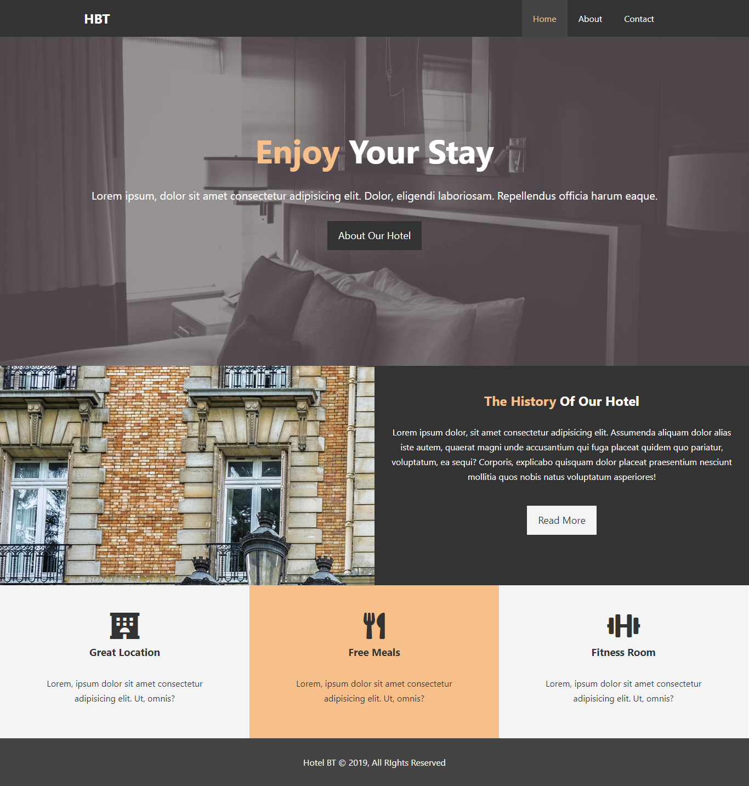
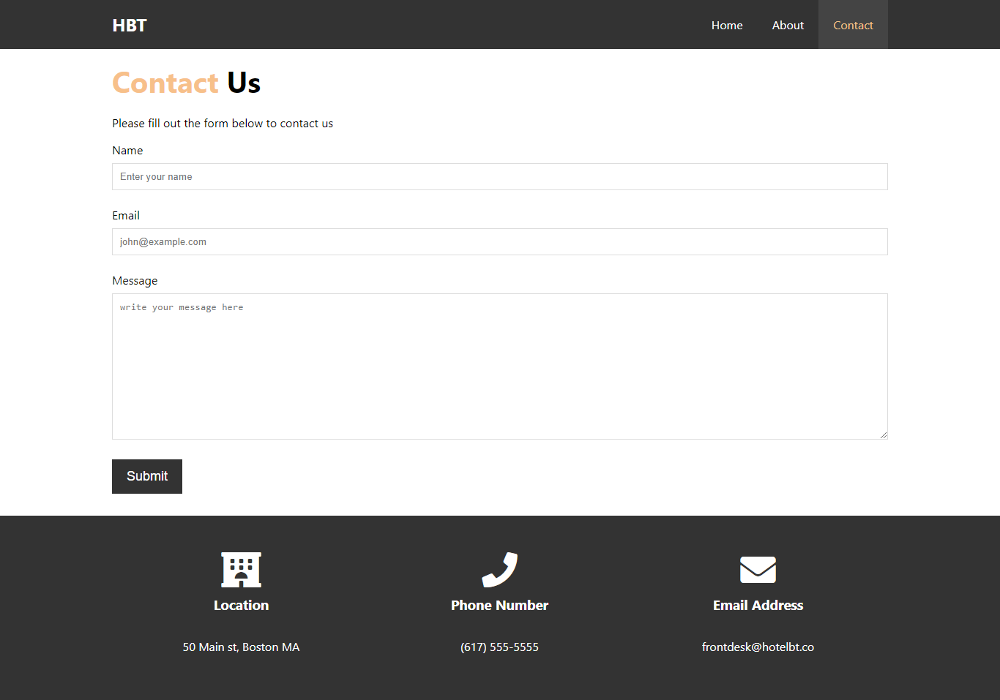

# Introduction

Hello Geeks, I'm sure you may heard about the Oyo rooms and visit their site atleast once. As we all know the Oyo rooms provided the rooms or hotels to the constumer via 
its Online platform i.e, OYO-ROOMS Website or OYO-ROOMS app. 

In this Microbyte, we will do the same. Sorry not completely same, we just try to make a static site named "HOTEL WEBSITE" using HTML and some CSS code. There are some
screenshots and images provided to you in a images folder. After making this static website, you can compare with the screenshots which we provided.

One of the screenshots is given below:
#### It is the Home page of our static website. 



# Prerequisites

For creating the static website, you must have familiar with HTML and some CSS.
If you don't know so much about that then don't worry, we will provided you all the materials so at the result you can easily create the static site. We will discuss about 
that one by one. First we discuss about HTML.

HTML(Hypertext Markup Language) is the standard markup language for documents designed to be displayed in a web browser. It can be assisted by technologies such as Cascading 
Style Sheets and scripting languages such as JavaScript.

Example:        


CSS(Cascading Style Sheets) is a style sheet language used for describing the presentation of a document written in a markup language such as HTML. CSS is a cornerstone 
technology of the World Wide Web, alongside HTML and JavaScript.

Example:


# IDE's(integrated development environment)

For writing code, you need a IDE or a code editor in which you can write your own code and able to edit in the code. There are lot of IDE's or editor in which you can code. 
Some of the best editor are Notepad++, Visual Studio Code, Sublime Text etc. You can even code in your Notepad that is preinstalled in windows but it is highly recommended to use 
IDE's/editor due to developer convinience. Here are the tutorials to download and setup the editors.

[VS Code](https://code.visualstudio.com/download)<br/>
[Sublime Text](https://www.sublimetext.com/3)<br/>
[Notepad++](https://notepad-plus-plus.org/downloads/)

We prefer to use VS Code because in this editor, there are many extensions which is very useful for the developer like formatting document, live server etc. You can search more
just typing in the google and search for the right one.
Here is the [link](https://www.youtube.com/watch?v=TeZdo8mx0gc) for installing the VS Code and its extension.

# Activities

## You need to write your own code in the place of TODO comments.

1. Add icons from [Fontawesome.com](https://fontawesome.com/icons?d=gallery) and search for each icon like dumbell, home, meals etc. If you don't know how to use the
fontawesome icons, again no need to worry about that, you can simply go through the reference link provided below:
https://www.youtube.com/watch?v=adSoD74EqIQ

```   
<section id="features">
    <div class="box bg-light">
      <!-- Add icons from fontawesome.com  -->
      <h3>Great Location</h3>
      <p>Lorem, ipsum dolor sit amet consectetur adipisicing elit. Ut, omnis?</p>
    </div>
    <div class="box bg-primary">
      <!-- Add icons from fontawesome.com  -->
      <h3>Free Meals</h3>
      <p>Lorem, ipsum dolor sit amet consectetur adipisicing elit. Ut, omnis?</p>
    </div>
    <div class="box bg-light">
      <!-- Add icons from fontawesome.com  -->
      <h3>Fitness Room</h3>
      <p>Lorem, ipsum dolor sit amet consectetur adipisicing elit. Ut, omnis?</p>
    </div>
  </section> 
```

2. Write your own code for creating a footer in all given html files and your footer looks like the given screenshot below.

```   
<footer id="main-footer">
    <!-- Write your code here -->
  </footer>  
```
  
 Screenshot:
  


3. Style the footer, font family , line height and many more in the css file and link this css file properly in all html files.

``` 
html,body {
 /* Set the font family and line height  */
}
```

```  
#main-footer{
    /* write your code here to design the footer */
} 
```

4. Add placeholders for name, email and message in contact.html.

``` 
<div class="form-group">
          <label for="name">Name</label>
          <input type="text" name="name" id="name" placeholder="">
        </div>  
```


Screenshot:




# Reference
[HTML: Hypertext Markup Language](https://www.w3schools.com/html/)<br/>
[CSS: Cascading Style Sheets](https://www.w3schools.com/css/default.asp)<br/>
[Visual Studio Code](https://code.visualstudio.com/download)
  
